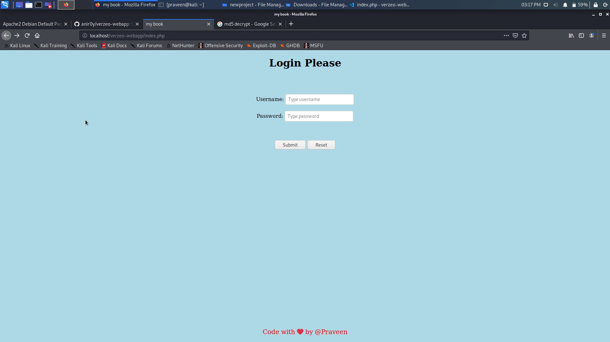

# Creating  Database MYSQL, Web Server Apache2 by PHP to enable a server to host dynamic websites and web apps.

Kali Linux installation step by step:

* First Download Kali linux.
Boot your pc with Kali Linux once booted, Select Graphical Install.
* Select your language and click continue. Select your Location and click continue.
* Configure your Keyboard and click continue.Type Your Desired Host name and click continue,again press continue button.
* Set your root password and click continue.Configure the Clock and click continue.
* Now Click on Guided – Use entire disk and click continue.Now click continue.
* Now Click on All Files in One Partition and click continue.Now click continue.
* Select option yes and click continue.Select option no and click continue.Select option yes and click continue.
* Now installation is finished and completed.
* So now you can use linux.
Log into Kali Linux with the username and password

# How to Install Apache on Ubuntu
* Open a terminal and type:
*     sudo apt-get update
*Step 1: Install Apache
* To install the Apache package on Ubuntu, use the command:
*     sudo apt-get install apache2
*Step 2: Verify Apache Installation
* To verify Apache was installed correctly, open a web browser and type in the address bar:
*     http://local.server.ip
*The web browser should open a page labeled “Apache2 Ubuntu Default Page,” as in the image below:

# How to install My Sql
* Open Terminal and run below command.
*     sudo apt-get install mysql-server

* Give the root password.
* Wait for the installation to finish.
* The installer itself start the MySql server. To check whether the MySql server is running or not, run below command.
*     sudo netstat -tap | grep mysql

* To make sure, your MySql installation works fine with Apache and PHP, run below command. It will install necessary modules to connect to a MySql database through PHP using Apache.
*     sudo apt-get install libapache2-mod-auth-mysql php5-mysql

* Installation is completed.
 
# Installation of Php
* In default we have php installed in Kali Linux, but check for the latest version and update it
*     sudo apt-install python3
* To check the version of
* php -v

# creating a Directory with sql,html,php files
 
 first go to the path which we want to create a folder/directory

 $ cd /var/www/html

 Now create a folder 
   
  $ sudo mkdir verzeo-webapp 

  $ sudo chmod 777 verzeo-webapp
 copy required files to create web login page of php,html and mysql from github

 git hub link

 # now create our own data base

 go to mysql

 $ sudo mysql -u root -p

 you will enter into mysql, there we need to check for databases we use syntax as 

 Mariadb()> show databases;

 

mariadb()> create database databasename;

EX: create database praveendb;

mariadb()> create user 'username'@'localhost' identified by 'password';

ex: create user 'dbuser'@'localhost' identified by 'dbpass';

give full permissions to your user

mariadb()> GRANT ALL PRIVILIGES ON databasename.* 'username'@'localhost' identified by 'password';

EX: GRANT ALL PRIVILIGES ON praveendb.* 'dbuser'@'localhost' identified by 'dbpass';

 

 mariandb()> exit;

 After exit from mysql loginto mysql using your username and password

 >$ sudo mysql -u username -p
 Enter password: user password

 ex: $ sudo mysql -u dbuser -p
Enter password: ******

-u stands for user in above command.
-p stands for password in above command

After entering to your mysql username use your database to add data into your database.

mariandb()> use database name

ex: mariandb()> use paraveendb

It looks as below screenshot.

create a table in your database 

mariandb(praveeendb) 
>CREATE TABLE IF NOT EXISTS `users` (
  `id` int(11) NOT NULL AUTO_INCREMENT,
  `username` varchar(200) NOT NULL,
  `password` varchar(33) NOT NULL,
  PRIMARY KEY (`id`)
) ENGINE=InnoDB  DEFAULT CHARSET=latin1 AUTO_INCREMENT=66 ;

add data in your tables

mariandb(praveendb)> INSERT INTO `users` (`id`, `username`, `password`) VALUES
(1, 'admin', '45becd6c5dd83e2179cd81df8640cd5a');

mariandb(praveendb)> INSERT INTO `users` (`id`, `username`, `password`) VALUES
(2, 'Harish', '45becd6c5dd83e2179cd81df8640cd5a');

mariandb(praveendb)> INSERT INTO `users` (`id`, `username`, `password`) VALUES
(3, 'Rahul', '45becd6c5dd83e2179cd81df8640cd5a');

mariandb(praveendb)> INSERT INTO `users` (`id`, `username`, `password`) VALUES
(4, 'Hemanth', '45becd6c5dd83e2179cd81df8640cd5a');

exit from Database.

* establish conection between database and server along with php file for the web login page

as shown in below screen shot

# change localhost(127.0.0.1)  to Domain name in Apache2 server

Go to path etc/apache2/sites-aviables

$ cd /etc/apache2/sites-aviables

@kali:/etc/apache2/sites-available $ ls

>000-default.conf  default-ssl.conf

Now copy 000-default.conf file into new file name as praveen.com.conf.

>kali:/etc/apache2/sites-available $ sudo cp 000-default.conf praveen.com.conf
[sudo] password for praveen: *****

>kali:/etc/apache2/sites-available $ ls

000-default.conf  default-ssl.conf  praveen.com.conf

Edit file name praveen.com.conf 

kali:/etc/apache2/sites-available $ sudo vim praveen.com.conf       

>servername praveen.com
serveradmin webmaster@localhost 
Documentroot /var/www/html

Now create localhost server to your device by editing /etc/hosts file with your domain name to the localhost, looks as below.

$ sudo vim /etc/hosts

$ sudo a2ensite praveen.com

$ sudo systemctl reload apache2

now we can see login page with domain name as praveen.com

