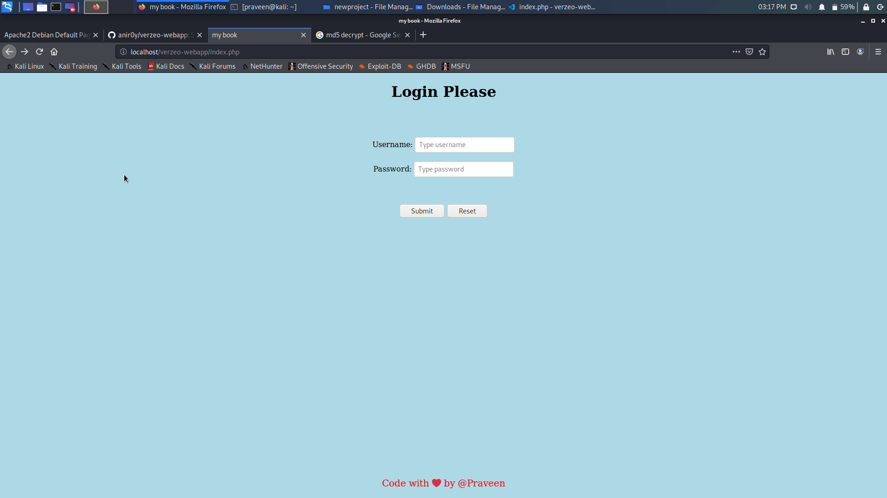
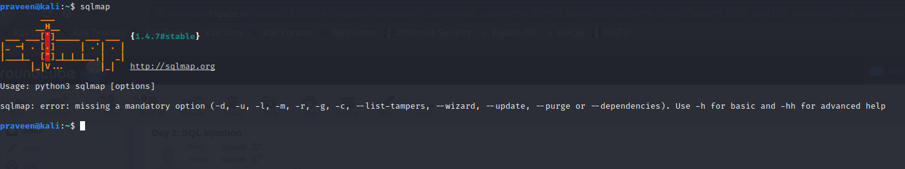

# SQL INJ
* SQL injection is a code injection technique that might destroy your database.
* SQL injection is one of the most common web hacking techniques.
* SQL injection is the placement of malicious code in SQL statements, via web page input. 

# Types of SQL Injection:

There are different types of SQL Injection attacks such as –

* Classic or In-band SQL Injection
        Error-based – Attacker uses the error generated by database to attack the
        Union-based – Leverages UNION SQL operator to combine to a response to return to HTTP response.
*    Blind or Inferential SQL Injection
        Boolean-based – Based on TRUE or FALSE return
        Time-based – Sends SQL injection that forces database to wait before responding.
*    Out-of-band SQL Injection – It occurs when the attacker cannot use the same channel to attack and gather results.

# Tools for SQL injection:

There are few tools used for SQL injection attack such as –

*    SQLMap – It is used for automatic SQL Injection And it is a Database Takeover Tool
*    Blind-Sql-BitShifting – It is a blind SQL Injection using BitShifting
*    jSQL Injection – It is a java tool used for automatic SQL Database Injection
*    BBQSQL – It is a blind SQL Injection Exploitation Tool
*    Whitewidow –  Scanning tool for vulnerability of SQL Database
*    Explo – It is a human And Machine-Readable Web Vulnerability Testing Format
*    Leviathan – It is a wide range audit toolkit
*    Blisqy – It is used to exploit time-based blind-SQL injection in HTTP-Headers.

# SQL Map

Step 1: Get a Linux based Operating System.

* If you are going to run SQLmap on Windows with Python, make sure you have Python installed, and skip down to the next step. Otherwise, get your Linux system fired up. Either install a Linux virtual machine (Ubuntu or Kali recommended) on Windows (Virtualbox / VMware / Parrallels) or boot up your Linux desktop.

* If you run Microsoft Windows as your main operating system, it is convenient and simple to run an install of Ubuntu Linux (or Kali Linux) in a virtual machine. You can then play with sqlmap, nmap, nikto and openvas along with a hundred other powerful open source security tools. 

# Using SQLMAP tool and Burp suite we are going to attack and retreat data from our created website(http://praveen.com/index.php)

Check SQL Vulnerablity in targeted website.If yes then proceed the following process

Use simple payloads to make sure site is vulnerable.

Open Your Browser then targeted website and give the random usernames and passwords and press the submit button.

Step 2: SQLmap Installation

* Python is pre-installed in Ubuntu, Now open sqlmap tool in your system terminal.
* It looks as below screenshot.
> nmap

>$  sqlmap -r sql1 http://praveen.com/index.php --dbs
* -r means sql1
* saved file is http://praveen.com/index.php 
* Select Y(yes) to all the search fields.

>$ sqlmap -r sql1 http://praveen.com/index.php -D praveen -T users -- dump
* From this above command sqlmap search all kind of parameters.
D - Database praveen, T - Table users,dump - dumping total data in table called users.

